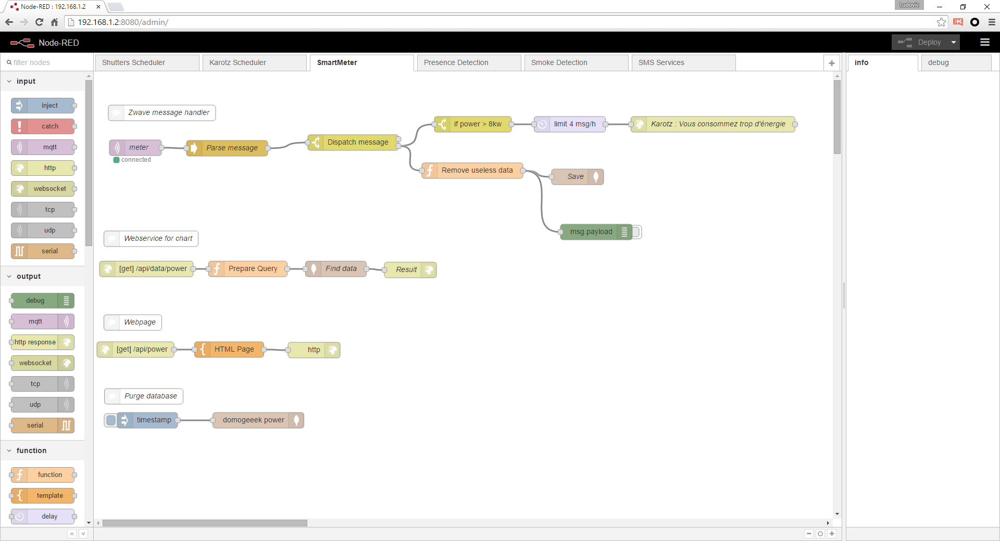
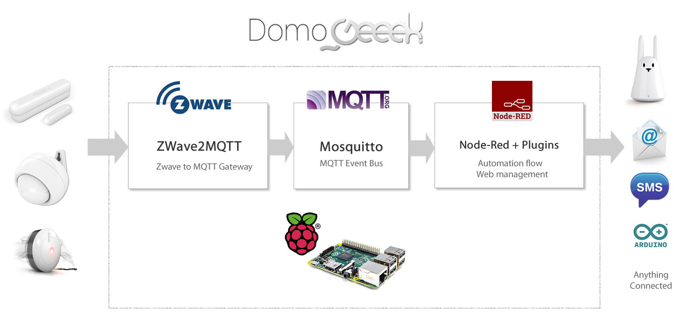

DomoGeeek is an OpenSource home automation solution running on a Raspberry Pi and based on Node-RED.



Preinstalled Node-Red modules for home-automation : 
* Scheduler : Schedule tasks at fixed time or sun time.
* MongoDB : MongoDB connector for saving data.
* Ping : Check the availability of Internet

The flows in the project can be reuse as example for your needs.

This project works perfectly with the [ZWave2MQTT](https://github.com/ltoinel/ZWave2MQTT) module for interaction with Z-Wave devices throw an MQTT bus.



----
#Tutorial

## Prerequisites 
* Install NodeJS 

```sh
$ sudo apt-get install curl
$ sudo curl --silent --location https://deb.nodesource.com/setup_0.12 | bash -
$ sudo apt-get install --yes nodejs
```

## Optional
* Install MongoDB and start the daemon

```sh
$ sudo apt-get install mongodb-server
```

* Install Mosquitto and start the daemon

```sh
wget http://repo.mosquitto.org/debian/mosquitto-repo.gpg.key
sudo apt-key add mosquitto-repo.gpg.key
sudo wget http://repo.mosquitto.org/debian/mosquitto-jessie.list
sudo apt-get update
sudo apt-get install mosquitto
```

## Install 

```sh
$ cd ./domogeeek/
$ npm install
```

## Test 

```sh
$ ./start.sh
```

Then open your browser on : http://127.0.0.1/admin/ and play with the nodes.

## Deploy 

```sh
$ sudo npm install pm2 -g
$ ./pm2.sh
$ pm2 startup
$ pm2 save
```