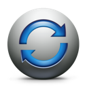
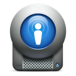
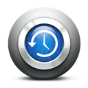

**DomoGeeek** is a set of small applications for home automation based on Z-Wave / Raspberry Pi / NodeJS / MongoDB.

**DomoGeeek** provides a **Restful API** based on resources exposed by the Express.js framework.

The goal of DomoGeeek is to provide a set of small modular applications to allow any **geek** to create their **own home automation box** quickly.
All the apps provided can be used separately. They can be modified and adapted easily.

*Note : These small NodeJS apps are fully experimental. You can use PM2 to start the apps and maintain them up.*

## Architecture schema


## My installation 
* A Raspberry Pi with a Z-wave Dongle / Raspian / NodeJS and MongoDB that hosts all the NodeJS apps.
* An Android Phone that provides me a free SMS gateway and notifies me when there is a power outage.


----
#Core apps description

## GroupSMS 
 *Exchanges SMS with your neighbourhood.*

The GroupSMS application allows people to subscribe and unsubscribe to SMS lists.
When a message is sent to the list by SMS, the message is also distributed to all the subscribers by SMS. GroupSMS is a kind of SMS Hub.
This application is useful to connect all your neighbours throw an SMS Mailing list.
This application uses an SMS Gateway. I use the Android SMS Gateway application to send and receive SMS freely.
All the messages and subscriptions are saved into a MongoDB database.

## ZwaveBus
 *Captures and sends Z-Wave events on your Z-wave devices.*

The ZwaveBus application allows you to communicate with your Z-Wave devices. All the Z-Wave events received by the Raspberry Pi are transmitted to an event bus developed in NodeJS.
You can quickly develop your own listeners that subscribe to specific Z-Wave events. Few lines of codes are enough to retrieve or submit some Z-Wave events.

There are currently 3 listeners available : 
* Movement detection
* smoke detection
* power consumption. 

You can use them as samples to develop your own listeners for your devices.
To understand what are the Command Class to listen, I recommend you to start the ZwaveBus with the debug options activated.
This project is based on the OpenZwave project and a NodeJS Wrapper.
This module exposes a webservice to known the real time power consumption, last presence detection ... 

## Multipush
 *Broadcast text message to your devices.*

The Multipush application allows to broadcast messages on multiple communication channels : sms, mail, karotz, openkarotz ...
The Multipush application exposes a simple REST service easy to use to send a message quickly to any configured devices.

## Presence
 *Checks human presence in your home*
 
The Presence applications allows to check if a known presence is inside your home. This application uses the Smartphone Wifi detection (using the Freebox API) and 
Karotz Tag to check if there is somebody known inside the home.
This application exposes a REST service that returns who is inside the home: a known mobile device or a guest that used the Karotz RFID tag to announce his presence.
This application is used by the "Presence" module inside the ZwaveBus project to check when a movement is detected if their is a known person into the home.

## Scheduler
 *Schedules tasks in your home*

The Scheduler application provides a tasks mechanism to schedule tasks like opening or closing the shutters automatically regarding the sunset and sunrise hours, reminder you when trash cans needs to be put outside the home.
This application is based on a Cron module from NodeJS. You can easily add your own tasks in the tasks directory or extend the existing ones.

----
#Tutorial

* Install Node (http://nodejs.org/download/)
* Install MongoDB and start the daemon
* Install the dependencies modules, this will create a "node_modules" directory inside the project
```sh
$ cd ./domogeeek/
$ npm install
```
* Configure the apps that you plan to use
```sh
$ cd apps/scheduler/
$ mv config-sample.js config.js
$ vi config.js
```
* Test the app quickly
```sh
$ node app.js
ctrl+c to close the app
```
* Install pm2 
```sh
$ npm install pm2 -g
```
* Start the apps into a daemon
```sh
$ pm2 start ./apps/scheduler/app.js --name scheduler
$ pm2 start ./apps/presence/app.js --name presence
.....
```
* Check the logs and flush them if needed
```sh
$ pm2 logs
$ pm2 flush
.....
```
* Check apps status and the memory
```sh
$ pm2 list
$ pm2 monit
.....
```

