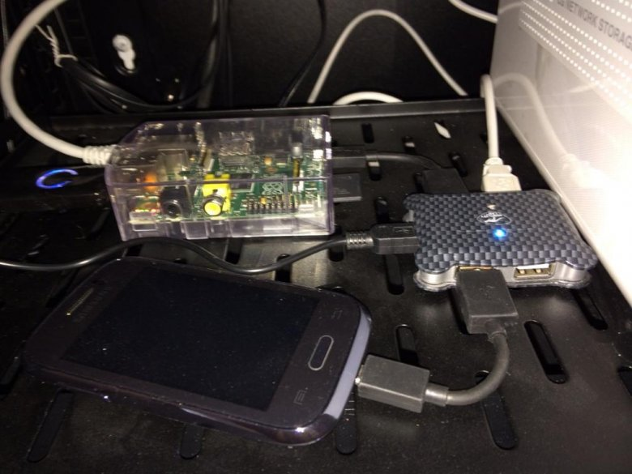

Domotic apps experiments based on Z-wave / Raspberry / NodeJS / MongoDB.
These small NodeJS apps are totally experimental.

## GroupSMS
The Group SMS app allows persons to subscribe to group SMS. 
When a message is sent to this list, the message is sent also to all the subscribers of the list.
Useful to connect all your neighbours throw an SMS Mailing list.

## ZwaveBus
The ZwaveBus app allows to manage your Zwave devices. All the events received are transmit to a bus.
You can quickly develop your own listeners that respond automatically to Z-Wave events.
All changed value events are stored into MongoDB.
There is currently 2 listeners available that you can use to create your own Zwave Listener : Fibaro smoke detector and AEON LABS Multisensor.

## Multipush
The Multipush app allows to broadcast a message on multiple canal : sms, mail, karotz, openkarotz ...
Multipush exposes a REST service easy to use to send a message quickly to any device.

## Presence
The presence app allows to check if a known presence is inside the home. This presence app uses the Smartphone Wifi detection and 
Karotz Tag to check if there is somebody known inside the home.
This app exposes a REST service that return who is inside the home.

## Scheduler
The Scheduler app provides a tasks mechanism to schedule tasks like opening or closing the shutters automatically when your are in travel.
This app is based on the cron module from NodeJS.

----
### Directory description

* apps : Contains Node.js apps.
* deps : Contains specific Node.js modules that need to be installed (npm install xxxx -g)
* lib  : Contains shared libraries for the apps.